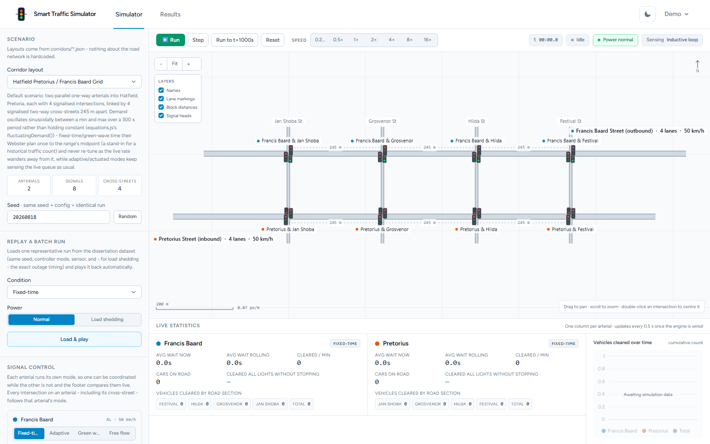
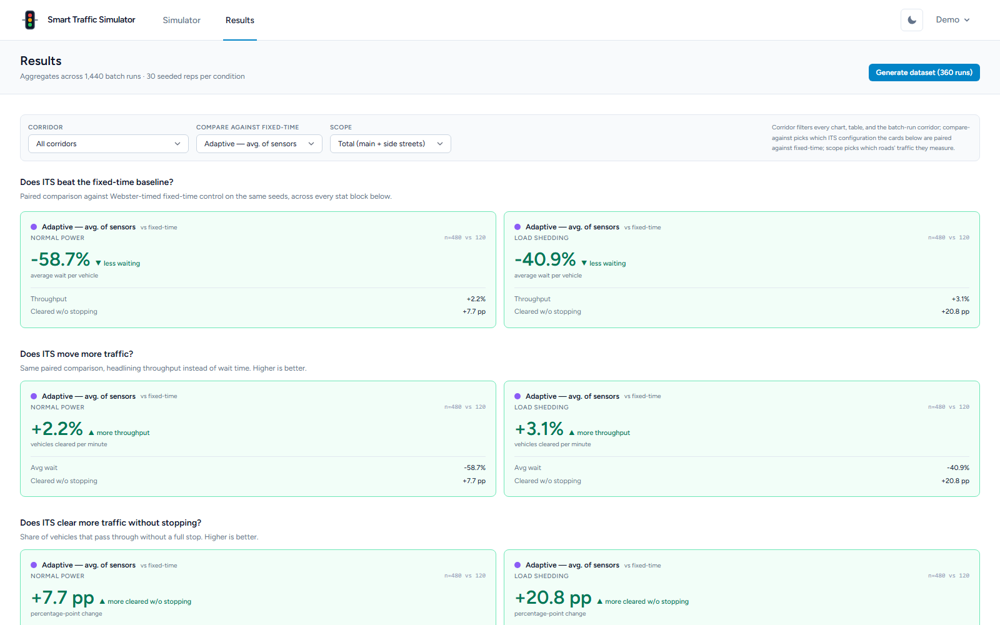
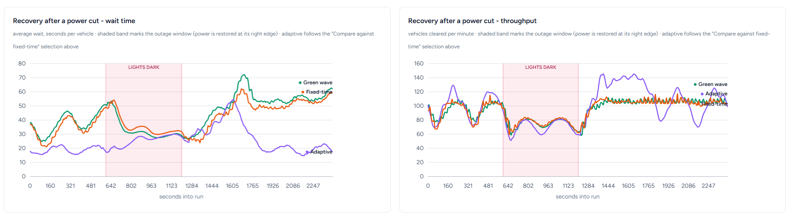

# ARTIS — Adaptive Road Traffic Intersection System

Browser-based traffic simulator comparing **fixed-time**, **sensor-adaptive** and
**green-wave** signal control on the same corridor and the same seeded traffic,
then cutting the power mid-run to see which assumptions survive. Modelled on a
South African context.

Default scenario: Pretorius Street (inbound) and Francis Baard Street (outbound)
into Hatfield, Pretoria — two one-way 4-lane arterials, four signalised
intersections each, joined by four signalised two-way cross-streets.

---

## Screenshots

**Simulator** — run, step, or fast-forward the corridor while comparing fixed-time,
adaptive and green-wave control live.



**Results** — aggregated results across hundreds of seeded batch runs, paired
against the fixed-time baseline.



**Recovery after a power cut** — how fast each controller mode gets wait time and
throughput back to their pre-cut levels.



---

## What it does

| Area | Details |
|---|---|
| `/simulator` road layout | Drawn from `corridors/*.json` — surfaces, lane markings, stop lines, junction boxes, signal heads, pan/zoom |
| Cars, IDM, lane changing | `resources/js/sim/car.js` + `engine.js` — IDM car-following, MOBIL-based lane changing, a 3-size truck mix with its own control slider |
| Controllers | `resources/js/sim/controllers/` — `fixedTime.js` (Webster's method), `adaptive.js` (sensor-driven, 4 sensor fidelity modes), `greenWave.js`, `allWayStop.js` (load-shedding fallback) |
| Sensors, load shedding | `sensors.js` — inductive loop / magnetometer / radar / camera fidelity degradation feeding `shouldExtendGreen()`; load-shedding forces all-way-stop |
| Stats footer / charts | Live numbers driven by `engine.js` snapshots, scoped Total / Arterial / Side-Streets |
| Seeded PRNG, headless runner | `rng.js`, `runHeadless.js` — byte-for-byte reproducible runs, used by both the browser and the CLI batch driver |
| Batch runner, `simulation_runs` | `batch/runBatch.mjs` sweeps the full 12-condition experimental matrix (`experimentalMatrix.js`) and posts results via `POST /api/simulation-runs` / `/api/recovery-ticks` |
| `/results` charts | Real charts against real `simulation_runs` / `simulation_run_recovery_ticks` queries in `ResultsController`, scoped Total / Arterial / Side-Streets, with paired fixed-time comparisons and recovery-time (both throughput- and wait-based) metrics |

On top of the core simulation: lane changing + trucks, the Total/Arterial/
Side-Streets scope split, wait-based recovery metrics alongside the original
throughput-based ones, and per-scope pre/during/post-outage segment stats. A
plateau detector (`resources/js/sim/plateau.js`, `batch/warmupDiagnostics.mjs`)
confirms the 360s warm-up window is sufficient for every scope.

`tests/Feature/NavigationTest.php` guards navigation, layout, and every
control against regressions: log in, land on `/simulator`, see the layout and
every control, switch to `/results`, see the charts and their table twins, log
out.

---

## Running it locally

Served by Laravel Herd at **http://traffic-simulator.test**.

The project folder is `Traffic-Simulator`. A directory junction maps it to the
`traffic-simulator` hostname without needing admin rights:

```
mklink /J "%USERPROFILE%\.config\herd\config\valet\Sites\traffic-simulator" "%USERPROFILE%\Herd\Traffic-Simulator"
```

(`herd link traffic-simulator` does the same thing but needs elevation, because it
creates a symlink rather than a junction.)

Setup from scratch:

```
composer install
npm install
cp .env.example .env && php artisan key:generate
php artisan migrate --seed
npm run build      # or: npm run dev
```

Sign in with `demo@traffic-simulator.test` / `password` (seeded by
`DatabaseSeeder`), or register a new account.

### Database

Runs on **MySQL** (`traffic_simulator` database on `127.0.0.1:3306`), per the spec.
`.env` is configured with:

```
DB_CONNECTION=mysql
DB_HOST=127.0.0.1
DB_PORT=3306
DB_DATABASE=traffic_simulator
DB_USERNAME=root
DB_PASSWORD=...
```

SQLite (`database/database.sqlite`) still works as a fallback if MySQL isn't
available — just set `DB_CONNECTION=sqlite`.

### Tests

```
php artisan test
```

`tests/Feature/NavigationTest.php` covers the full navigation path: log in,
land on `/simulator`, see the layout and every control, switch to `/results`,
see the charts and their table twins, log out.

---

## Layout is data, not code

Nothing about the road network is hardcoded. `corridors/*.json` drives it:

| File | Purpose |
|---|---|
| `hatfield-pretorius-francisbaard.json` | The default scenario: 2 arterials × 4 intersections + 4 connectors |
| `two-intersection-test.json` | Smallest config that still exercises the loader |
| `single-intersection.json` | One 4-way junction, far easier to debug controllers on |

`SimulatorController` serves them at `GET /corridors/{id}`; the scenario picker
fetches on change. They live at the project root rather than in `public/` or the
JS bundle because the headless batch runner has to read the same files from
disk — one source of truth for both the browser and Node.

**Geometry conventions** (see `resources/js/sim/corridor.js`):

- metres; x increases east, y increases **south**, matching canvas axes
- each arterial has an `origin` and a `direction`; intersection positions are
  derived by walking the `distanceToNextM` chain, so the distances that drive the
  green-wave offsets are the same numbers that place the drawing
- **left-hand traffic** (South Africa): for a heading, the lanes carrying it and
  its signal head are on the left of the centreline

**Default scenario geometry.** Cross-streets west to east along Pretorius
(inbound/eastbound) are **Jan Shoba, Grosvenor, Hilda, Festival**, a uniform
**245 m** apart; Francis Baard runs the same block sequence in reverse, being
outbound/westbound. Because every block is the same length, the green-wave offset
chain is a constant step — 245 m ÷ 13.89 m/s ≈ **17.6 s per intersection** at the
50 km/h target speed — which makes the progression band unusually easy to
verify by hand.

---

## Where things live

```
routes/web.php                        # /, /simulator, /corridors/{id}, /results, /api/*
app/Support/CorridorRepository.php    # reads corridors/*.json
app/Http/Controllers/
  SimulatorController.php             # simulator page + corridor JSON endpoint
  ResultsController.php               # real simulation_runs / recovery_ticks queries, scoped metrics
  SimulationRunController.php         # POST /api/simulation-runs
  RecoveryTickController.php          # POST /api/recovery-ticks
app/Models/SimulationRun.php
database/migrations/                  # simulation_runs + simulation_run_recovery_ticks, scoped columns
corridors/*.json                      # layout configs
resources/views/
  simulator.blade.php                 # canvas, control rail, stats footer
  results.blade.php                   # charts, paired comparisons, scoped table twins
resources/js/
  sim/corridor.js                     # config -> geometry graph
  sim/equations.js                    # IDM, Webster's, green-wave offset, MOBIL, Poisson arrivals — all cited
  sim/car.js                          # vehicle types (car + 3 truck sizes), IDM stepping
  sim/engine.js                       # tick loop, lane changes, sensors, load shedding
  sim/controllers/                    # fixedTime.js, adaptive.js, greenWave.js, allWayStop.js
  sim/sensors.js                      # sensor fidelity modes
  sim/rng.js                          # seeded PRNG
  sim/runHeadless.js                  # headless engine driver shared by browser + batch runner
  sim/plateau.js                      # convergence/plateau detector (warm-up verification)
  sim/experimentalMatrix.js           # the 12-condition controller x power x sensor matrix
  sim/renderer.js                     # canvas draw + pan/zoom camera
  simulator.js                        # page wiring, control state, logging
  charts/theme.js                     # shared Chart.js theme + palettes
  results.js                          # dashboard charts, scope/target filters
batch/
  runBatch.mjs                        # CLI sweep of the experimental matrix -> POST /api/simulation-runs
  warmupDiagnostics.mjs               # plateau-detector CLI, confirms WARMUP_TICKS
  verify.mjs
public/cars/                          # car sprites
results/                              # batch run CSV/JSON output — populated per condition x power state
```

## Models behind the simulation

Each behaviour model has a citation rather than ad hoc rules:

- **Car following** — Intelligent Driver Model (Treiber, Hennig & Helbing, 2000)
- **Lane changing** — MOBIL (Kesting, Treiber & Helbing, 2007), politeness/
  threshold tuned per vehicle type so trucks change lanes less readily than cars
- **Fixed-time timing** — Webster's method (Webster, 1958) for cycle length and
  phase splits, so the baseline is a legitimate implementation, not a strawman
- **Adaptive control** — threshold/gap-extension heuristic mirroring the
  sense–decide–execute ATSC loop of SCATS/SCOOT
- **Green wave** — standard progression-band coordination,
  `offset = distance / target speed`, per arterial and one-directional

## Theming

**Light is the default.** Night mode is opt-in via the toggle in the header, next
to the signed-in user; the choice is remembered in `localStorage`.

`prefers-color-scheme` is deliberately **not** consulted — a visitor with a dark
OS still gets the white UI until they ask for night mode. `NavigationTest` asserts
this, so it cannot regress by accident.

Three layers have to agree, and only the first is pure CSS:

| Layer | How it switches |
|---|---|
| Page chrome | Tailwind `dark:` variants, `darkMode: 'class'`, class on `<html>` |
| Canvas map | `PALETTES.light` / `PALETTES.dark` in `resources/js/sim/renderer.js`, repainted on toggle |
| Charts | ink swapped by `applyChartTheme()`, then every chart rebuilt |

`resources/js/theme.js` owns the state and fires `theme:change`; the simulator and
results pages subscribe via `onThemeChange`. A small inline script
(`resources/views/partials/theme-boot.blade.php`) applies the class before first
paint so the wrong theme never flashes.

The light map is not an inversion of the dark one: on a pale carriageway the lane
markings go **dark**, because white lines would be invisible.

### Chart palettes

Series colours are **identical in both themes**, which is a checked result rather
than a shortcut: every slot was validated against a white surface *and* against
the dark surface — inside the lightness band for each mode, over the chroma floor,
≥ 3:1 on the surface, and the worst adjacent pair separating by ΔE ≥ 10 under
simulated colour-vision deficiency. Holding them steady means an entity does not
change colour when you flip the theme. Only the ink (text, grid, axis, surface)
switches.

Controller modes are orange / violet / emerald; arterials are blue / orange.
Colour follows the entity, never its rank, and text never wears a series colour —
a coloured dot beside it carries identity. Re-run the validator before shifting
any of these values. See `resources/js/charts/theme.js` and
`resources/js/sim/renderer.js`.
